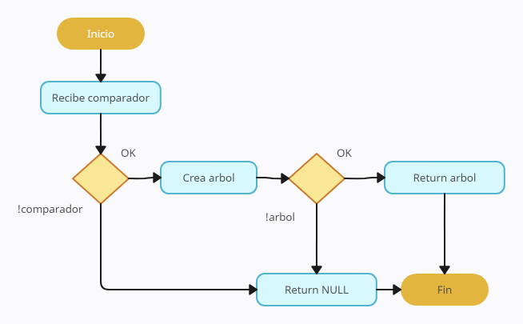
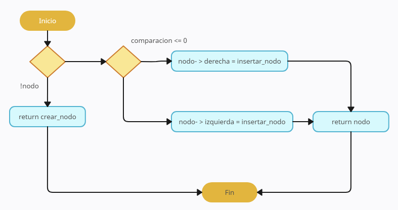
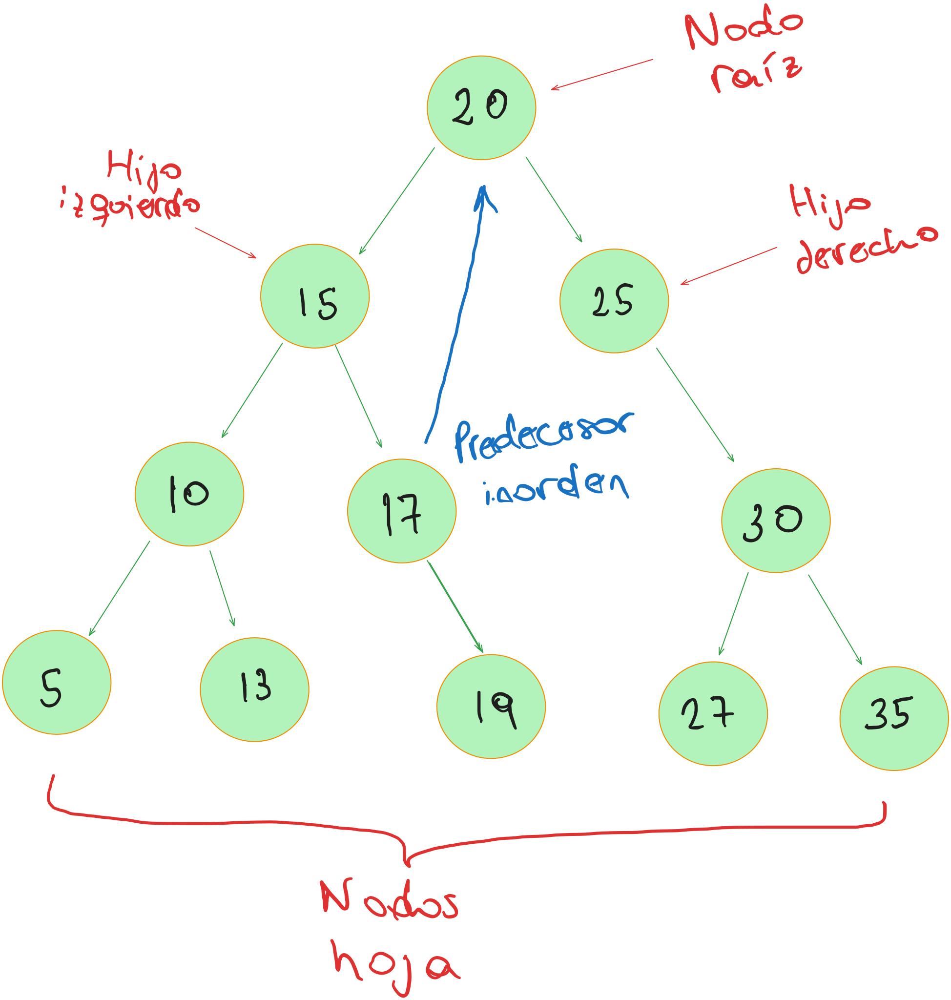

# TDA ABB

## Repositorio de Lucas Aldonate - 100030 - laldonate@fi.uba.ar

- Para compilar:

```bash
make pruebas_chanutron
```

- Para ejecutar:

```bash
./pruebas_chanutron
```

- Para ejecutar con valgrind:
```bash
make valgrind-chanutron
```
---
##  Funcionamiento

Se crea un abb, en caso de que no haya errores, se procede a utilizar las distintas funciones de dicho abb.
A diferencia del tp anterior, donde en una lista se puede insertar valores al inicio, al medio o al final,
en el caso del abb generalmente (depende del valor del elemento), la insercion suele ser al final del arbol.

Existen varios casos a analizar, por ejemplo, si el arbol esta vacio, el elemento a insertar se convierte
en la raiz de dicho arbol. Al insertar el segundo elemento, dependiendo de si este es menor o mayor a la raiz,
se insertar a la izquierda o a la derecha respectivamente, y asi con los proximos elementos a insertar, respetando
siempre ese orden predeterminado.

A continuacion un diagrama tanto para la creacion del abb, como la insercion. La insercion utiliza una funcion recursiva
auxiliar `insertar_nodo`, que fue creada (al igual que varias funciones auxiliares mas que luego seran mostradas) debido
a que todas las funciones del abb reciben el arbol como parametro en lugar de un nodo.

`abb_crear`

<div align="center">

</div>

`insertar_nodo`

<div align="center">

</div>

### Funciones auxiliares

Como se menciona anteriormente, se crearon varias funciones auxiliares recursivas, las cuales son llamadas por
las funciones originales del abb. Dichas funciones son:

`crear_nodo`

```c
nodo_abb_t *crear_nodo(void *elemento)
{
	nodo_abb_t *nodo = calloc(1, sizeof(nodo_abb_t));

	if (!nodo)
		return NULL;

	nodo->elemento = elemento;

	return nodo;
}
```

`buscar_nodo`

```c
void *buscar_nodo(nodo_abb_t *nodo, void *elemento, abb_t *arbol)
{
	if (!nodo || arbol->comparador(nodo->elemento, elemento) == 0)
		return nodo;

	if (arbol->comparador(nodo->elemento, elemento) < 0)
		return buscar_nodo(nodo->derecha, elemento, arbol);

	return buscar_nodo(nodo->izquierda, elemento, arbol);
}
```

`insertar_nodo`

```c
nodo_abb_t *insertar_nodo(nodo_abb_t *nodo, void *elemento, abb_t *arbol)
{
	if (!nodo)
		return crear_nodo(elemento);

	if (arbol->comparador(nodo->elemento, elemento) <= 0)
		nodo->derecha = insertar_nodo(nodo->derecha, elemento, arbol);
	else
		nodo->izquierda =
			insertar_nodo(nodo->izquierda, elemento, arbol);

	return nodo;
}
```
`buscar_predecesor`

```c
nodo_abb_t *buscar_predecesor(nodo_abb_t *nodo)
{
	if (!nodo)
		return NULL;

	if (!nodo->derecha)
		return nodo;

	return buscar_predecesor(nodo->derecha);
}
```

`quitar_nodo`

```c
void *quitar_nodo(nodo_abb_t *nodo, void *elemento, abb_t *arbol)
{
	if (!nodo)
		return NULL;

	if (arbol->comparador(nodo->elemento, elemento) == 0) {
		if (!nodo->izquierda && !nodo->derecha) {
			free(nodo);
			return NULL;
		}

		if (!nodo->izquierda || !nodo->derecha) {
			nodo_abb_t *nodo_aux = nodo->izquierda ?
						       nodo->izquierda :
						       nodo->derecha;
			free(nodo);
			return nodo_aux;
		}

		nodo_abb_t *maximo_izquierdo =
			buscar_predecesor(nodo->izquierda);
		nodo->elemento = maximo_izquierdo->elemento;
		nodo->izquierda = quitar_nodo(
			nodo->izquierda, maximo_izquierdo->elemento, arbol);
		return nodo;
	}

	if (arbol->comparador(nodo->elemento, elemento) < 0)
		nodo->derecha = quitar_nodo(nodo->derecha, elemento, arbol);

	nodo->izquierda = quitar_nodo(nodo->izquierda, elemento, arbol);

	return nodo;
}
```

`destruir_nodo`

```c
void destruir_nodo(nodo_abb_t *nodo)
{
	if (!nodo)
		return;

	destruir_nodo(nodo->izquierda);
	destruir_nodo(nodo->derecha);
	free(nodo);
}
```

`destruir_elemento`

```c
void destruir_elemento(nodo_abb_t *nodo, void (*destructor)(void *))
{
	if (!nodo)
		return;

	destruir_elemento(nodo->izquierda, destructor);
	destruir_elemento(nodo->derecha, destructor);
	destructor(nodo->elemento);
}
```

`recorrer_iterador_interno`

```c
size_t recorrer_iterador_interno(nodo_abb_t *nodo, abb_recorrido recorrido,
				 bool (*funcion)(void *, void *), void *aux,
				 size_t *cantidad, bool *seguir)
{
	if (!nodo)
		return 0;

	switch (recorrido) {
	case PREORDEN:
		(*cantidad)++;
		if (!funcion(nodo->elemento, aux))
			*seguir = false;
		if (*seguir)
			recorrer_iterador_interno(nodo->izquierda, recorrido,
						  funcion, aux, cantidad,
						  seguir);
		if (*seguir)
			recorrer_iterador_interno(nodo->derecha, recorrido,
						  funcion, aux, cantidad,
						  seguir);
		break;
	case INORDEN:
		recorrer_iterador_interno(nodo->izquierda, recorrido, funcion,
					  aux, cantidad, seguir);
		if (*seguir) {
			(*cantidad)++;
			if (!funcion(nodo->elemento, aux))
				*seguir = false;
		}
		if (*seguir)
			recorrer_iterador_interno(nodo->derecha, recorrido,
						  funcion, aux, cantidad,
						  seguir);
		break;
	case POSTORDEN:
		recorrer_iterador_interno(nodo->izquierda, recorrido, funcion,
					  aux, cantidad, seguir);
		recorrer_iterador_interno(nodo->derecha, recorrido, funcion,
					  aux, cantidad, seguir);
		if (*seguir) {
			(*cantidad)++;
			if (!funcion(nodo->elemento, aux))
				*seguir = false;
		}
		break;
	default:
		return 0;
	}
	return *cantidad;
}
```

`recorrer_con_array`

```c
size_t recorrer_con_array(nodo_abb_t *nodo, abb_recorrido recorrido,
			  void **array, size_t tamanio_array, size_t *cantidad)
{
	if (!nodo || !array)
		return *cantidad;

	switch (recorrido) {
	case PREORDEN:
		if (*cantidad >= tamanio_array)
			return *cantidad;
		array[*cantidad] = nodo->elemento;
		(*cantidad)++;
		recorrer_con_array(nodo->izquierda, recorrido, array,
				   tamanio_array, cantidad);
		recorrer_con_array(nodo->derecha, recorrido, array,
				   tamanio_array, cantidad);
		return *cantidad;
	case INORDEN:
		recorrer_con_array(nodo->izquierda, recorrido, array,
				   tamanio_array, cantidad);
		if (*cantidad >= tamanio_array)
			return *cantidad;
		array[*cantidad] = nodo->elemento;
		(*cantidad)++;
		recorrer_con_array(nodo->derecha, recorrido, array,
				   tamanio_array, cantidad);
		return *cantidad;
	case POSTORDEN:
		recorrer_con_array(nodo->izquierda, recorrido, array,
				   tamanio_array, cantidad);
		recorrer_con_array(nodo->derecha, recorrido, array,
				   tamanio_array, cantidad);
		if (*cantidad >= tamanio_array)
			return *cantidad;
		array[*cantidad] = nodo->elemento;
		(*cantidad)++;
		return *cantidad;
	default:
		return 0;
	}
}
```

---

## Respuestas a las preguntas teóricas

### Respuesta 1

Arbol:

Un arbol es una coleccion de nodos, que pueden estar conectados a multiples nodos. Consiste
de un nodo principal (nodo raiz), y cero o muchos subarboles no vacios, los cuales tambien tienen 
su raiz conectada mediante un vertice al nodo raiz. 
Se originan debido a la necesidad de representar una jerarquia en el tda, y tambien optimizar la
busqueda lineal de una lista. La intencion con los arboles es hacer algo similar a la busqueda binaria 
con el objetivo de tener una mejoria de tiempo a la hora de acceder a los datos.

Arbol binario:

Se relacionan intimamente con las operaciones de busqueda con el objetivo de aproximarse como se menciona
anteriormente, a la busqueda binaria. A diferencia del arbol, la raiz se conecta unicamente a dos subarboles, 
con el objetivo de poder determinar con facilidad la izquierda y la derecha.
En esta version entran en juego los recorridos (inorden, preorden y postorden).
- Preorden: primero visita el nodo actual, luego el subarbol izquierdo y finalmente el derecho.
- Inorden: primero visita el subarbol izquierdo, luego el nodo actual y finalmente el subarbol derecho.
- Postorden: primero visita el subarbol izquierda, luego el derecho y finalmente el nodo actual.

Arbol binario de busqueda:

Muy parecido al arbol binario, presenta un orden, por lo cual se desprende una forma de comparar los elementos, 
con el fin de definir este orden y cada nodo del arbol posee un valor o una clave unica.
Es importante aclarar como funciona la insercion, las claves mayores se insertar en los subarboles derechos,
las claves menores en los izquierdos, y ambos subarboles son tambien de busqueda binaria.

Las operaciones principales son insercion, eliminacion y busqueda. Estas tres operaciones poseen una complejidad
algoritmica del tipo O(log(n)), esto se debe a que la busqueda es una busqueda binaria, y como ya sabemos, la busqueda
binaria es del tipo divide y conquista, y posee una complejidad de O(log(n)). Tanto la insercion como la eliminacion, utilizan
la busqueda binaria para encontrar el lugar en donde se deba realizar la operacion correspondiente (ya sea insertar o eliminar un nodo).
En el peor de los casos (donde el arbol no se encuentre balanceado), la complejidad algoritmica es de O(n). Imaginemos el caso en el que
se insertan (en orden) los numeros 1,2,3,4 y 5. Queda una rama con todos hijos derechos, y en este caso si deseamos buscar el numero 5, se 
debe recorrer el arbol en su totalidad, por ende, la complejidad de este caso es O(n).

A continuacion un diagrama de un abb para entender un poco mejor su estructura:

<div align="center">

</div>

### Respuesta 2

En esta implementacion, se opto por utilizar todas las funciones de manera recursiva en lugar de iterativa. La razon de esto, es que en 
algunas funciones, si se plantearan de forma iterativa habria que utilizar una implementacion de pila para mantener un rastro de los 
distintos recorridos que se utilizan. Utilizando la forma iterativa, seria mas laborioso y desde algun punto de vista incluso mas 
engorroso. La forma recursiva simplifica las funciones y es mas facil de seguir.
Algo importante para aclarar, como ya se menciono anteriormente, debido a que todas las funciones del abb reciben como parametro el 
arbol en su totalidad, se utilizaron funciones auxiliares (recursivas obviamente), que reciben un nodo en lugar del arbol completo, para luego
ser llamadas en las funciones originales.